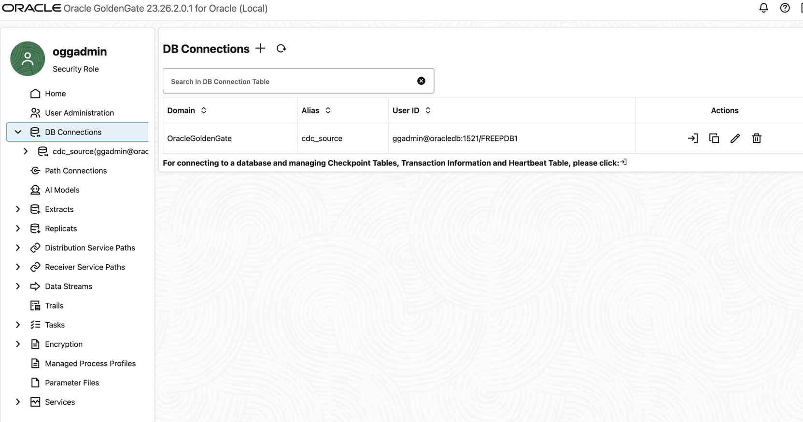
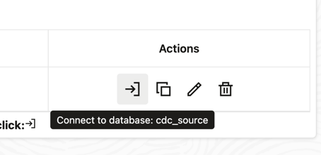
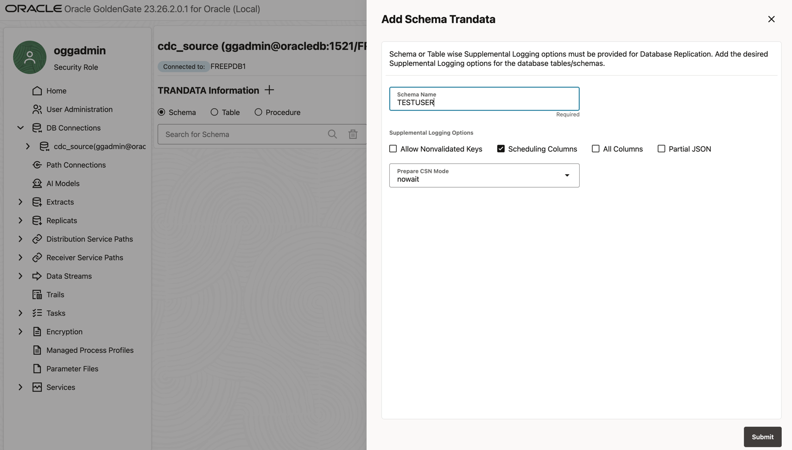
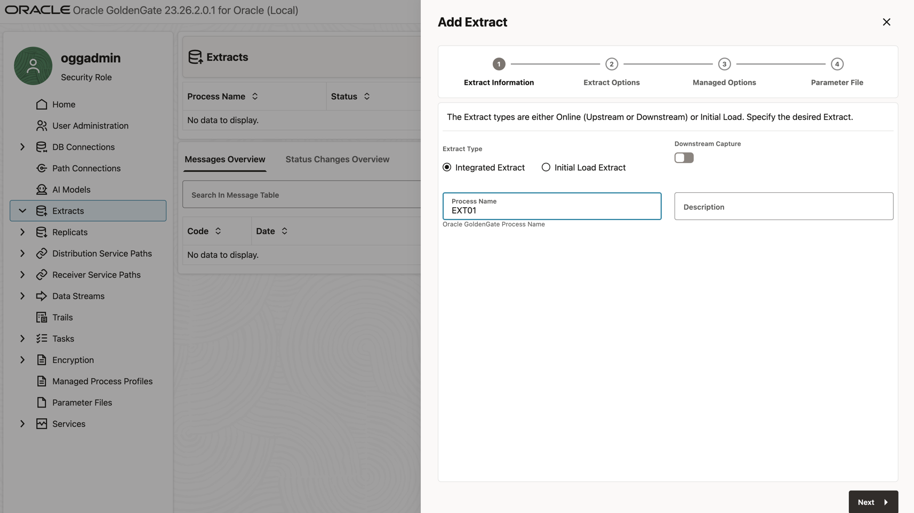
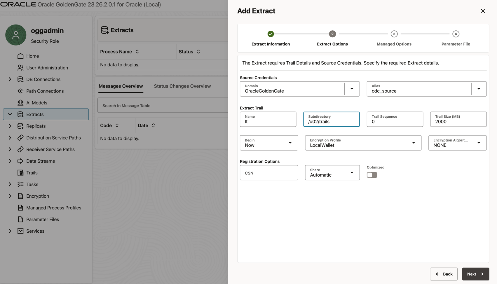
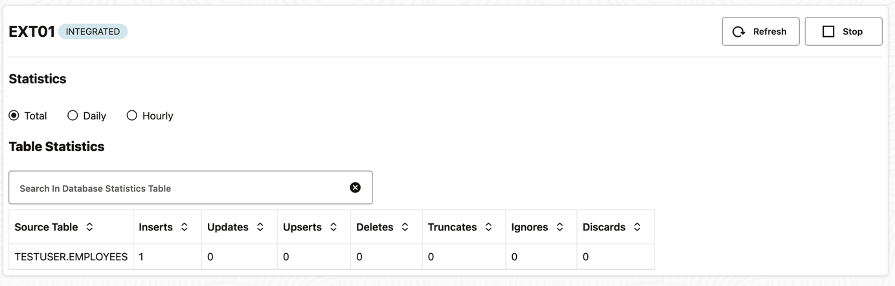
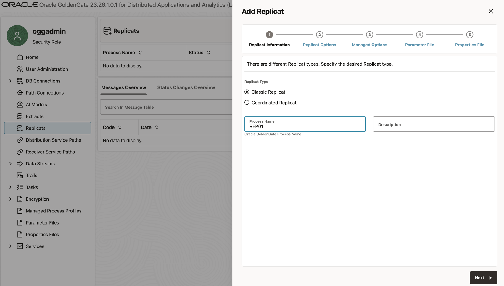
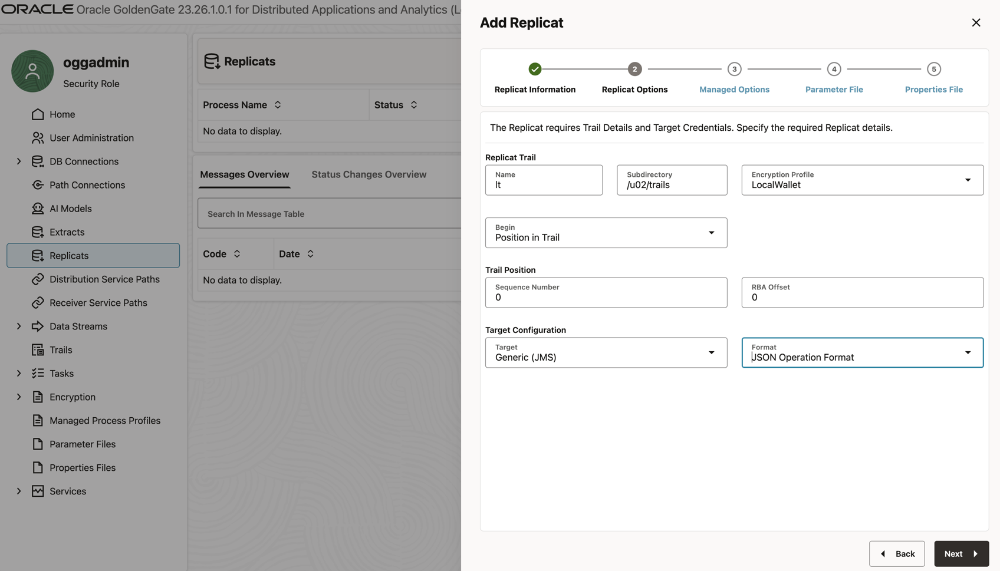
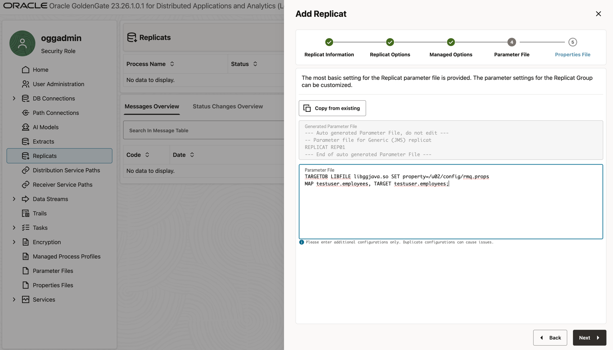
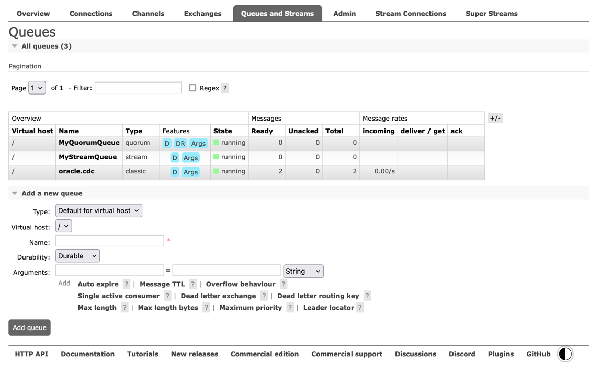

> **Note:** Only works on Linux. Uses commercial Oracle GoldenGate — ensure no license violations before use.

# Oracle GoldenGate to RabbitMQ

A fully containerised CDC (Change Data Capture) pipeline that streams every INSERT, UPDATE, and DELETE from an Oracle
23ai database to a RabbitMQ exchange in real time, with no application-level code changes required.

---

## How it works

```
┌─────────────────────────┐     redo      ┌──────────────────────┐
│   Oracle DB Free 23ai   │─────logs─────▶│  GoldenGate Capture  │
│   (CDB / FREEPDB1 PDB)  │   (LogMiner)  │  goldengate-oracle   │
└─────────────────────────┘               └──────────┬───────────┘
                                                     │ trail files
                                              shared Docker volume
                                                     │
                                          ┌──────────▼───────────┐
                                          │  GoldenGate DAA      │
                                          │  goldengate-daa      │
                                          │  (JMS handler)       │
                                          └──────────┬───────────┘
                                                     │ JMS
                                          ┌──────────▼────────────────────┐
                                          │  RabbitMQ 4.3                 │
                                          │  jms.durable.queues exchange  │
                                          │  oracle.cdc                   │
                                          └───────────────────────────────┘
```

The pipeline has two GoldenGate engines communicating via a shared volume of **trail files** — a binary, sequenced log
format native to GoldenGate. The trail file acts as a durable buffer: if RabbitMQ goes down, capture keeps running and
delivery automatically resumes from its last checkpoint when RabbitMQ recovers.

### Component responsibilities

| Container            | Image                                       | Role                                                                 |
|----------------------|---------------------------------------------|----------------------------------------------------------------------|
| `oracledb`           | `database/free`                             | Source Oracle 23ai (CDB + FREEPDB1 PDB)                              |
| `gg-capture`         | `goldengate-oracle`                         | Reads Oracle redo logs → writes trail files                          |
| `gg-daa`             | `goldengate-distributed-apps-and-analytics` | Reads trail files → publishes to RabbitMQ via JMS                    |
| `rabbitmq`           | `rabbitmq:4.3-management`                   | Receives CDC events on `jms.durable.queues`, streams to `oracle.cdc` |
| `init-trails-volume` | `alpine`                                    | One-shot init that fixes shared volume permissions                   |

## TL;DR

The [testing](TESTING.md) results are in below

- [Results](TESTING_RESULT.md)

---

## Technical decisions

### Two GoldenGate engines, not one

Oracle CDC from redo logs requires GoldenGate for Oracle, which is a separate product from GoldenGate DAA (Distributed
Apps and Analytics). Splitting them is not just Docker convenience — it mirrors the real-world deployment pattern where
capture runs close to the database and delivery runs close to the target system. The trail file boundary also means the
two processes can be upgraded, restarted, or scaled independently.

### Integrated Extract over Classic Extract

The Extract is configured as **Integrated**, which uses Oracle's internal LogMiner infrastructure rather than reading
redo logs directly. Integrated Extract is the required mode for Oracle 23ai CDB/PDB architectures — it registers with
the database as a LogMiner capture server (`OGG$EXT_01` in `all_apply`) and receives change records from the kernel,
giving it access to in-memory undo that Classic Extract cannot see.

### Pinned image digests

All four container images are pinned by SHA-256 digest rather than a floating tag. GoldenGate and Oracle image updates
can change internal behaviour (parameter names, default paths, GGSCI syntax) in ways that aren't reflected in a
changelog. Pinning makes the environment fully reproducible.

### Commercial `goldengate-oracle`, not `goldengate-oracle-free`

The free edition of GoldenGate for Oracle does not support Integrated Extract against a CDB. The commercial image is
required. The free image reference is left commented in `docker-compose.yml` as a warning.

### init-trails-volume container

The `shared_trails` Docker volume is created with root ownership. GoldenGate runs as the `ogg` user (UID 54321) and
cannot write trail files unless it owns the directory. A one-shot Alpine container runs `chown -R 54321:54321` before
either GoldenGate container starts, using `depends_on: condition: service_completed_successfully` to enforce ordering.

### File-system JNDI in rmq.props

The JMS handler locates the RabbitMQ connection factory and destination via JNDI. Rather than maintaining a separate
`jndi.properties` file, the JNDI bootstrap properties (`java.naming.factory.initial`, `java.naming.provider.url`) are
embedded directly in `rmq.props`. The provider URL points to `file:/u02/config/` where the `.bindings` file lives,
keeping all JMS configuration in one directory mount.


---

## Prerequisites

Download the RabbitMQ JMS client and its dependencies:

```bash
mvn clean dependency:copy-dependencies -DoutputDirectory=./gg_jars -DincludeScope=runtime
```

---

## Start the stack

```bash
docker compose up
```

Wait until all four containers are healthy (`oracledb`, `rabbitmq`, `gg-capture`, `gg-daa`). Oracle takes the longest —
typically 2–3 minutes on first boot.

---

## Configure GG Capture

### 1. Log in to the Admin UI

Open `https://localhost:8444` in your browser. The container uses a self-signed certificate, so bypass the browser
warning (Advanced → Proceed).

| Field    | Value           |
|----------|-----------------|
| Username | `oggadmin`      |
| Password | `Welcome#12345` |

---

### 2. Create a Database Credential

GoldenGate needs a stored credential to connect to the Oracle PDB.

1. On the landing page, click **Administration Service**.
2. Open the hamburger menu → **Configuration**.
3. Under the **Database** tab, click **+** (Add Credential).
4. Fill in the fields:

   | Field             | Value                            |
   |-------------------|----------------------------------|
   | Credential Domain | `OracleGoldenGate`               |
   | Credential Alias  | `cdc_source`                     |
   | User ID           | `ggadmin@oracledb:1521/FREEPDB1` |
   | Password          | `Welcome123##`                   |


<details><summary>Screenshot</summary>



</details>

5. Click **Submit**.
6. Click on **Actions** **Connect to DB:cdc_source**

<details><summary>Screenshot</summary>



</details>

---

### 3. Enable Schema-Level TRANDATA

This registers the schema with GoldenGate so it tracks any tables added in the future.

1. On the Configuration page, click the **Connect to database** icon next to `cdc_source`. The indicator should turn
   green.
2. Scroll down to the **TRANDATA** section and click **+** (Add TRANDATA).
3. In the **Schema** field enter `TESTUSER` and click **Submit**.

<details><summary>Screenshot</summary>



</details>
---

### 4. Create the Integrated Extract

1. Open menu → **Extract**.
2. Click **+** (Add Extract) → select **Integrated Extract** → click **Next**.

<details><summary>Screenshot</summary>



</details>
3. Fill in the options:

| Field             | Value              |
|-------------------|--------------------|
| Process Name      | `EXT_01`           |
| Trail Name        | `lt`               |
| Sub Directory     | `/u02/trails`      |
| Credential Domain | `OracleGoldenGate` |
| Credential Alias  | `cdc_source`       |

<details><summary>Screenshot</summary>



</details>

4. Click **Next** to reach the Parameter File screen.
5. Append the following line at the bottom of the generated parameter file:
   ```
   TABLE testuser.employees;
   ```

<details><summary>Screenshot</summary>


</details>
6. Click **Create and Run**.

---

### 5. Verify the Extract is Running

The `EXT_01` process appears on the Extracts dashboard. It starts yellow (initialising) and turns green (running) within
a few seconds.

To confirm data capture is working, insert a row:

```bash
docker exec -it oracledb sqlplus 'testuser/Welcome123##@//localhost:1521/FREEPDB1'
```

```sql
INSERT INTO employees (emp_id, name, department, salary)
VALUES (2, 'Bob', 'Marketing', 75000);
COMMIT;
EXIT;
```

In the Admin UI, click **EXT_01** → **Statistics**. The insert should appear as a captured operation.
<details><summary>Screenshot</summary>



</details>
---

## Configure Oracle DAA

The DAA (Delivery) engine reads the trail files written by GG Capture and publishes CDC events to RabbitMQ via the JMS
handler.

### 1. Verify trail files are visible

Confirm the trail files written by `gg-capture` are accessible inside the `gg-daa` container via the shared volume:

```bash
docker exec -it gg-daa ls -l /u02/trails
```

Expected output (at least one trail file starting with `lt`):

```
total 4
-rw-r----- 1 ogg ogg 1350 May 25 14:11 lt000000000
```

---

### 2. Log in to the DAA Admin UI

Open `https://localhost:8443` in your browser and bypass the self-signed certificate warning.

| Field    | Value           |
|----------|-----------------|
| Username | `oggadmin`      |
| Password | `Welcome#12345` |

---

### 3. Create the Replicat

1. On the landing page, click **Administration Service**.
2. Open the hamburger menu → **Overview**.
3. Click **+** (Add Replicat) → select **Classic Replicat** → click **Next**.

<details><summary>Screenshot</summary>



</details>
4. Fill in the options:

| Field         | Value         |
   |---------------|---------------|
| Process Name  | `REP_01`      |
| Trail Name    | `lt`          |
| Sub Directory | `/u02/trails` |

Choose `Generic (JMS)` and `JSON Operation Format`.
<details><summary>Screenshot</summary>



</details>
5. Click **Next** to reach the Parameter File screen.
6. Replace the generated content with the following:

   ```
   TARGETDB LIBFILE libggjava.so SET property=/u02/config/rmq.props
   MAP testuser.employees, TARGET testuser.employees;
   ```

<details><summary>Screenshot</summary>



</details>
7. Click **Create and Run**.

---

### 4. Verify messages are reaching RabbitMQ

Open the RabbitMQ Management UI at `http://localhost:15672` (guest / guest) and navigate to **Exchanges** →
`jms.durable.queues`. Insert another row into Oracle:

```bash
docker exec -it oracledb sqlplus 'testuser/Welcome123##@//localhost:1521/FREEPDB1'
```

```sql
INSERT INTO employees (emp_id, name, department, salary)
VALUES (3, 'Carol', 'Sales', 65000);
COMMIT;
EXIT;
```

The message count on `jms.durable.queues` should increment, confirming the full pipeline is working.
`oracle.cdc` queue will be binded to that exchange.

<details><summary>Screenshot</summary>



</details>