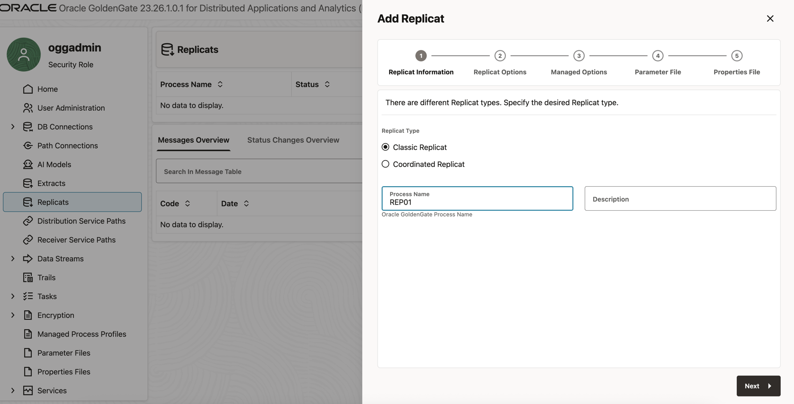
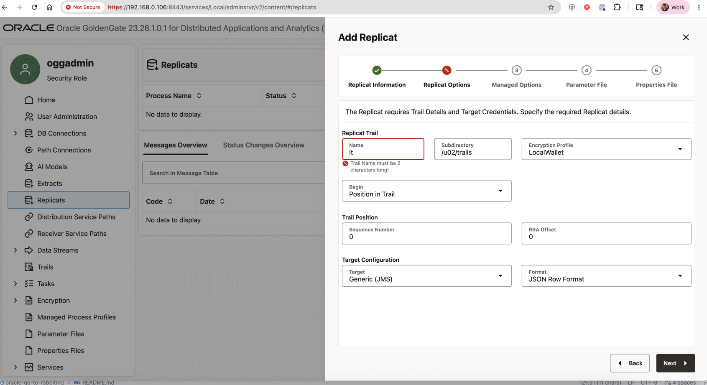
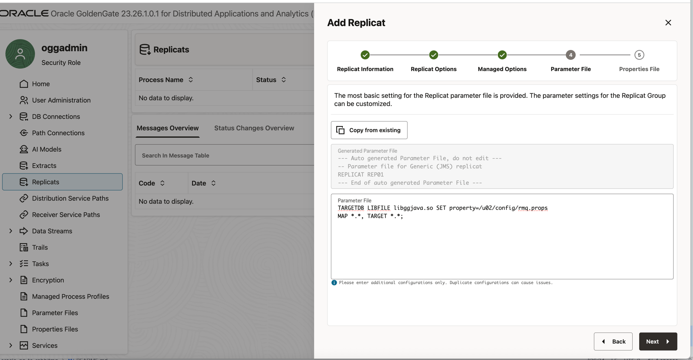

> **Note:** Only works on Linux. Uses commercial Oracle DAA — ensure no license violations before use.

# Oracle GoldenGate to RabbitMQ

Streams Oracle Database CDC events to RabbitMQ using two GoldenGate engines:
- **gg-capture** — GoldenGate for Oracle (reads redo logs, writes trail files)
- **gg-delivery** — GoldenGate DAA (reads trail files, publishes to RabbitMQ)

---

## Prerequisites

Download the RabbitMQ JMS client and its dependencies:

```bash
mvn clean dependency:copy-dependencies -DoutputDirectory=./gg_jars -DincludeScope=runtime
```

---

## Start the stack

```bash
docker compose up
```

Wait until all four containers are healthy (`oracledb`, `rabbitmq`, `gg-capture`, `gg-daa`). Oracle takes the longest — typically 2–3 minutes on first boot.

---

## Configure GG Capture

### 1. Log in to the Admin UI

Open `https://localhost:8444` in your browser. The container uses a self-signed certificate, so bypass the browser warning (Advanced → Proceed).

| Field    | Value          |
|----------|----------------|
| Username | `oggadmin`     |
| Password | `Welcome#12345` |

---

### 2. Create a Database Credential

GoldenGate needs a stored credential to connect to the Oracle PDB.

1. On the landing page, click **Administration Service**.
2. Open the hamburger menu → **Configuration**.
3. Under the **Database** tab, click **+** (Add Credential).
4. Fill in the fields:

   | Field               | Value                               |
   |---------------------|-------------------------------------|
   | Credential Domain   | `OracleGoldenGate`                  |
   | Credential Alias    | `cdc_source`                        |
   | User ID             | `ggadmin@oracledb:1521/FREEPDB1`    |
   | Password            | `Welcome123##`                      |

5. Click **Submit**.

---

### 3. Enable Schema-Level TRANDATA

This registers the schema with GoldenGate so it tracks any tables added in the future.

1. On the Configuration page, click the **Connect to database** icon next to `cdc_source`. The indicator should turn green.
2. Scroll down to the **TRANDATA** section and click **+** (Add TRANDATA).
3. In the **Schema** field enter `TESTUSER` and click **Submit**.

---

### 4. Create the Integrated Extract

1. Open the hamburger menu → **Overview**.
2. Click **+** (Add Extract) → select **Integrated Extract** → click **Next**.
 Fill in the options:

   | Field               | Value                 |
   |---------------------|-----------------------|
   | Process Name        | `EXT_01`              |
   | Trail Name          | `lt`                  |
   | Sub Directory       | `/u02/trails`         |
   | Credential Domain   | `OracleGoldenGate`    |
   | Credential Alias    | `cdc_source`          |


4. Click **Next** to reach the Parameter File screen.
5. Append the following line at the bottom of the generated parameter file:
   ```
   TABLE testuser.employees;
   ```
6. Click **Create and Run**.

---

### 5. Verify the Extract is Running

The `EXT_01` process appears on the Extracts dashboard. It starts yellow (initialising) and turns green (running) within a few seconds.

To confirm data capture is working, insert a row:

```bash
docker exec -it oracledb sqlplus 'testuser/Welcome123##@//localhost:1521/FREEPDB1'
```

```sql
INSERT INTO employees (emp_id, name, department, salary) VALUES (2, 'Bob', 'Marketing', 75000);
COMMIT;
EXIT;
```

In the Admin UI, click **EXT_01** → **Statistics**. The insert should appear as a captured operation.

# Configure Oracle DAA

```
$ docker exec -it gg-daa ls -l /u02/trails
total 4
-rw-r----- 1 ogg ogg 1350 May 25 14:11 lt000000000
```






